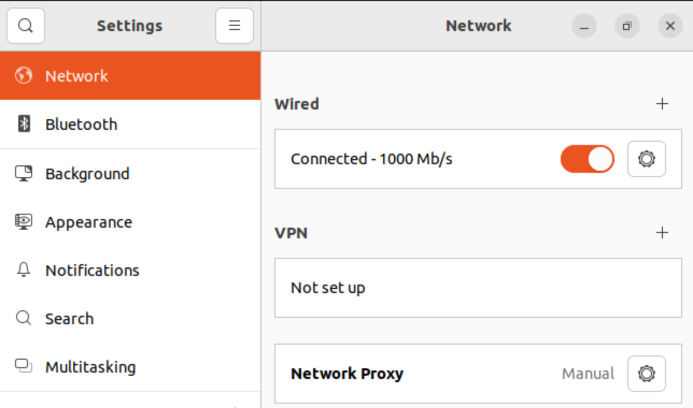

# Description
Instructions for installing and setting up VirtualBox with Ubuntu.  A VirtualBox installation of Ubuntu is different from a standard bare metal and this guides explains how to handle those discrepencies.  Instructions include methods to handle internet proxy if you are trying to connect your virtual machine to internet access.  

# Installation
1) Download the latest [Ubuntu LTS ISO](https://ubuntu.com/download/desktop).


2) Download & Install [VirtualBox](https://www.virtualbox.org/wiki/Downloads).

<figure>
        <p align="center">
        
        </p>
    <figcaption align = "center"><b>Create a new Virtual Machine in Virtual Box using Ubuntu ISO.</b></figcaption>
    </figure>

> Note: When asked about system resources set your virtual machine to use 50% of the host's RAM and CPU.

# Permissions
1) With VirtualBox you are not automatically added to the sudoer's group by default.  To add yourself perform the following:
    ```bash
    sudo su -   # upgrade to root first
    sudo usermod -aG sudo <username>  # add yourself to sudoers
    ```

2) Logout/login in order for the effects to register.

# Setup Proxy Settings

## Web Access
1) Open **Settings -> Network** in Ubuntu Apps and configure the proxy addresses
   
    <figure>
        <p align="center">
        
        </p>
    <figcaption align = "center"><b>Set the Network Proxy to manual and enter in your proxy if you are using one.  Otherwise ignore.</b></figcaption>
    </figure>

2) Verify proxy settings work by opening a [webpage](www.duckduckgo.com).
   
## Apt
1) Add the following to `/etc/apt/apt.conf`:
   ```bash
   Acquire::http::Proxy "<proxy_address>";
   ```
2) Verify that proxy settings work:
   ```bash
   sudo apt update  # can reach host if proxy works
   ```

## Wget
1) Add the following to `/etc/wgetrc`:

    ```bash
    use_proxy=yes
    http_proxy=<proxy_address>
    https_proxy=<proxy_address>
    ```
2) Verify wget via:
   ```bash
   wget github.com # will complain if it needs a proxy
    ```

# Host Integration
## Installing Guest Additions
Select **Top Menu -> Devices -> Upgrade Guest Additions**

   * Guest Additions will greatly enhance your experience with Virtual Box because it provides user improvements that are not normally provided by the ISO image.


## Copy/Paste Integration
Select **Top Menu -> Devices -> Shared Clipboard -> Bidirectional**

## File Sharing
1) Create a folder on your virtual machine in **/mnt/shared**:

    ```bash
    mkdir /mnt/shared # this will be your mount point
    ```

2) Turn off virtual machine.
3) **VirtualBox -> Settings -> Shared Folders**

    <figure>
        <p align="center">
        
        </p>
    <figcaption align = "center"><b>Set the Network Proxy to manual and enter in your proxy if you are using one.  Otherwise ignore.</b></figcaption>
    </figure>

    <figure>
        <p align="center">
        
        </p>
    <figcaption align = "center"><b>Set a path on the host machine to a mount point inside the virtual machine.</b></figcaption>
    </figure>

# Performance
## 3D Acceleration
Select **VirtualBox -> Settings -> Display**:
 - For visualization tasks, enabling 3D acceleration can sometimes provide a performance boost.
 - Maximizing the Video Memory can also provide improved performance.

<figure>
        <p align="center">
        
        </p>
    <figcaption align = "center"><b>Configuring the video settings can improve performance for certain tasks.</b></figcaption>
    </figure>